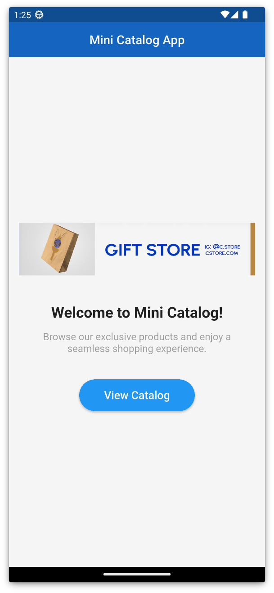
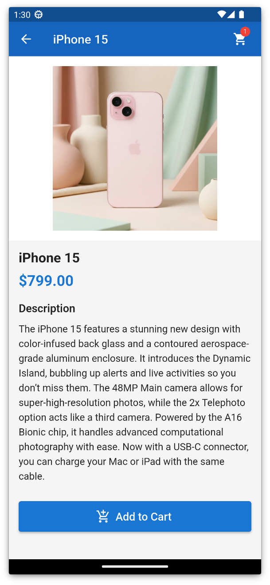
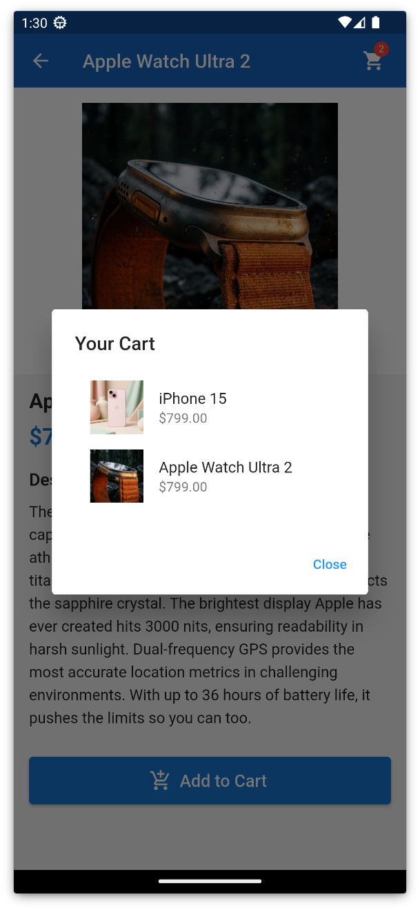

# Mini Katalog Uygulaması

Selam! Bu proje, Flutter eğitimim kapsamında hazırladığım "Mini Katalog Uygulaması" prototipi. Staj sürecim için temel Flutter yapılarını, sayfa geçişlerini ve API'den veri çekme mantığını öğrenmek amacıyla bu projeyi geliştirdim.

## Neler Yaptım?

- **Sayfa Yapıları**: Uygulamayı Ana Sayfa, Ürün Listesi ve Ürün Detayı olmak üzere 3 ekrana böldüm. Kodun düzenli olması için `models`, `pages` ve `widgets` şeklinde bir klasör yapısı kullandım.
- **Canlı Veri (WantAPI)**: Ürünleri `wantapi.com` üzerinden canlı olarak çekiyorum. Eğitimde "ekstra paket kullanmayın" dendiği için `http` paketi yerine Dart'ın kendi içindeki `HttpClient` (`dart:io`) yapısını kullandım. Bu sayede paketlere bağımlı kalmadan veri çekmeyi deneyimlemiş oldum. :)
- **Model ve JSON**: Gelen karmaşık veriyi kullanabilmek için `Product.fromJson` modelini yazdım. Fiyatlardaki dolar işaretini temizleyip sayıya çevirmek gibi ufak detayları da model içinde hallettim.
- **Sepet Mantığı**: Basit bir sepet sistemi simülasyonu ekledim. Ürün detayından ürün ekleyince sağ üstteki sayı güncelleniyor ve sepet ikonuna basınca eklenenleri görebiliyoruz.
- **Arama Özelliği**: Katalog ekranında ürün ismine göre arama yapılabilecek bir filtreleme sistemi kurdum.

## Kullanılan Sürümler
- Flutter 3.x
- Dart 3.x

## Projeyi Çalıştırma

1. Flutter SDK'nın yüklü olduğundan emin olun.
2. Proje klasörüne terminalden girin:
   ```bash
   cd mini_catalog_app
   ```
3. Gerekli ayarlar için:
   ```bash
   flutter pub get
   ```
4. Uygulamayı çalıştırmak için:
   ```bash
   flutter run
   ```

## Uygulama Ekran Görüntüleri

### 1. Giriş Ekranı
Hoş geldin ekranı ve projenin banner görseli.


### 2. Ürün Kataloğu
WantAPI'den çekilen ürünlerin listelendiği ve arama yapılabilen ekran.


### 3. Ürün Detayı
Ürünün açıklaması ve sepete ekleme butonu.


### 4. Sepetim
Eklenen ürünleri gösteren basit sepet diyaloğu.

